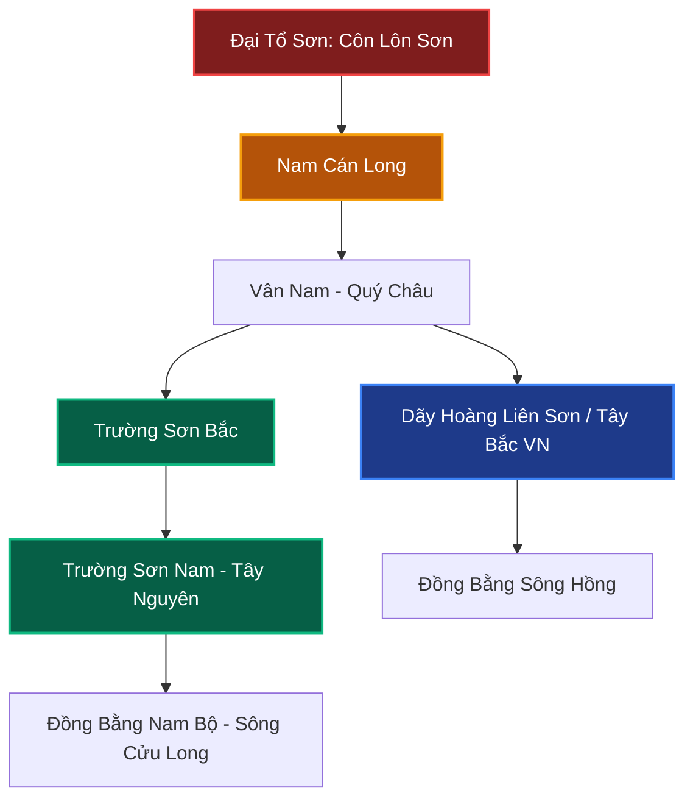

# Chương 1: Tổng Quan Địa Thế & Hệ Thống Long Mạch Việt Nam

> **Khái quát:** Phân tích cấu trúc phong thủy địa lý quy mô quốc gia của Việt Nam. Khởi nguồn long mạch từ rặng Côn Lôn, thế đất rồng cuộn ôm biển Đông, xương sống Trường Sơn cùng hai đại vựa phù sa sông Hồng và sông Cửu Long.

---

## 1. Nguồn Gốc Long Mạch: Từ Tổ Sơn Côn Lôn Xuyên Qua Bán Đảo Đông Dương

Trong địa lý phong thủy cổ truyền Á Đông, ngọn núi **Côn Lôn (Kunlun Shan)** được tôn vinh là **Đại Tổ Sơn** (nguồn gốc tối thượng của mọi mạch núi và dòng khí trên toàn lục địa châu Á). Từ đỉnh Côn Lôn linh thiêng, khí trường phát tán tỏa đi khắp nơi theo ba đại nhánh gọi là **Tam Đại Cán Long**:
1. **Bắc Long:** Đi vào vùng sa mạc Gobi, cao nguyên Mông Cổ và đồng bằng Hoa Bắc.
2. **Trung Long:** Men theo lưu vực Hoàng Hà và Trường Giang, tạo nên các vùng đất trù phú trung thổ Trung Hoa.
3. **Nam Long:** Bắt nguồn từ vùng núi tuyết Tây Tạng qua cao nguyên Vân Quý (Vân Nam - Quý Châu), chạy dài xuống bán đảo Đông Dương và Đông Nam Á.

Dải Nam Long khi tiến vào lãnh thổ Việt Nam đã chia tách thành các hệ thống núi non hùng vĩ:
- **Nhánh thứ nhất (Tây Bắc):** Dãy **Hoàng Liên Sơn** với đỉnh Fansipan (3.143m - Nóc nhà Đông Dương) đóng vai trò là **Thái Tổ Sơn** sừng sững của toàn bộ miền Bắc Việt Nam. Dòng khí từ đây đổ dồn theo hướng Tây Bắc - Đông Nam, hạ dần độ cao tạo thành các dải đồi trung du Phú Thọ, Thái Nguyên rồi kết tụ thành đồng bằng châu thổ sông Hồng màu mỡ.
- **Nhánh thứ hai (Trường Sơn):** Uốn lượn chạy dài suốt chiều dài đất nước tạo nên xương sống vững chắc cho miền Trung và vùng Tây Nguyên đất đỏ, che chở cho phần lãnh thổ phía Đông hướng ra biển lớn.

Khí của Côn Lôn là khí hùng mạnh của đất trời tích tụ qua hàng triệu năm kiến tạo địa chất. Khi vào Việt Nam, dòng khí này gặp khí ẩm của đại dương bốc lên, tạo nên sự giao thoa Âm Dương tuyệt vời: **Sơn (Dương) ngưng tụ, Thủy (Âm) dung dưỡng**, mang lại cho dải đất sức sống kiên cường và trường tồn.

---

## 2. Hình Thể Chữ S: "Kim Long Ẩm Hải" (Rồng Vàng Uống Nước Biển Đông)

Hình thể lãnh thổ Việt Nam uốn lượn hình chữ S trải dài trên 15 vĩ độ, trong phong thủy hình pháp được ví như hình tượng một con rồng vàng vươn mình ra biển:
- **Đầu Rồng (Đầu cán long):** Khu vực Đông Bắc và châu thổ Bắc Bộ, với mũi nhọn hướng ra vịnh Bắc Bộ, miệng rồng đón lấy ngọc ngà từ đại dương bao la.
- **Thân Rồng (Long Thân):** Vùng duyên hải miền Trung thon gọn, uyển chuyển, uốn lượn theo sườn dốc Trường Sơn, có sự co thắt lại như lưng rồng tạo thế vững chãi chịu đựng thử thách bão táp.
- **Đuôi Rồng (Long Vĩ):** Đồng bằng Nam Bộ mở rộng xòe ra hình cánh quạt, vẫy đuôi về phía vịnh Thái Lan và mũi Cà Mau, tạo nên sự trù phú sung túc về kinh tế và nông nghiệp.

Về phương vị địa lý phong thủy:
- **Minh Đường (Mặt tiền):** Toàn bộ mặt phía Đông là **Biển Đông** rộng lớn hàng triệu kilomet vuông, giữ vai trò một Đại Minh Đường khoáng đạt, đón nhận ánh sáng mặt trời mọc (Dương khí sơ khai) và gió đông nam mát lành.
- **Tiền Án & Ngoại Triều:** Quần đảo Hoàng Sa, Trường Sa và hàng ngàn hòn đảo ven bờ (Phú Quốc, Côn Đảo, Cát Bà, Cô Tô...) đóng vai trò như các bức bình phong, án sơn tiền triều giữ cho chân khí Minh Đường không bị tán xạ ra biển sâu.

---

## 3. Dãy Trường Sơn - "Long Cốt" Xương Sống Bảo Vệ Quốc Gia

Núi là điểm tựa (Huyền Vũ) trong phong thủy. Dãy Trường Sơn kéo dài gần 1.100 km, chia làm hai đoạn Trường Sơn Bắc và Trường Sơn Nam, là bức tường thành vững chãi bảo bọc lãnh thổ:
- **Trường Sơn Bắc (Từ sông Cả đến đèo Hải Vân):** Địa hình dốc đứng, sườn Đông hẹp và hiểm trở, sườn Tây thoải về phía Lào. Đoạn này có đèo Ngang, đèo Lao Bảo, dãy Hoành Sơn như chiếc khóa chốt vững chắc ngăn gió bão và giữ gìn khí mạch thâm sâu.
- **Trường Sơn Nam & Cao nguyên Tây Nguyên:** Phát triển thành những cao nguyên rộng lớn bằng phẳng (Kon Tum, Pleiku, Đắk Lắk, Lâm Viên, Di Linh) với đất đỏ bazan phì nhiêu giàu nguyên tố vi lượng. Đây là khối Thổ - Hỏa vượng, tạo nên thế tựa lưng sừng sững cho toàn bộ duyên hải Nam Trung Bộ và vùng kinh tế trọng điểm phía Nam.

Nhờ có "Long Cốt" Trường Sơn, dải đất Việt Nam không bị gió tây khô nóng từ lục địa Á - Âu thổi bay mất sinh khí, đồng thời che chắn gió bấc lạnh giá, duy trì khí hậu nhiệt đới ẩm dồi dào sức sống.

---

## 4. Hệ Thống Thủy Mạch - Động Mạch Chủ Nuôi Dưỡng Sinh Khí

Quy tắc bất di bất dịch của phong thủy cổ điển:
> *"Khí thừa phong tắc tán, giới thủy tắc chỉ."* (Khí gặp gió thì tán, gặp nước thì tụ lại).  
> *"Sơn quản nhân đinh, Thủy quản tài lộc."* (Núi chủ về con người, trí tuệ và sự vững bền; Sông ngòi chủ về tiền tài, của cải và sự thịnh vượng).

Việt Nam sở hữu hai hệ thống thủy mạch khổng lồ mang tầm vóc quốc tế:
1. **Lưu vực Sông Hồng (Miền Bắc):**
   - Hợp lưu từ Sông Đà (Hắc Thủy) dũng mãnh nhiều khoáng chất, Sông Thao (Hồng Hà) mang nặng phù sa đỏ, và Sông Lô trong xanh tại ngã ba Hạc (Việt Trì, Phú Thọ). Điểm tam giang hội tụ này chính là cửa ải tụ khí lịch sử của nhà nước Văn Lang cổ đại.
   - Sông Hồng uốn lượn như dải lụa ôm lấy kinh thành Thăng Long - Hà Nội, chia nhánh thành sông Đuống, sông Đáy, sông Luộc tỏa phù sa nuôi sống đồng bằng Bắc Bộ suốt hàng ngàn năm.
2. **Lưu vực Sông Cửu Long (Miền Nam):**
   - Bắt nguồn từ cao nguyên Tây Tạng, chảy qua 6 quốc gia trước khi đổ vào Việt Nam qua hai nhánh sông Tiền và sông Hậu.
   - Sau đó tẽ ra 9 cửa sông (Cửu Long ẩm hải) đổ ra biển Đông. Chín nhánh rồng phun nước là biểu tượng của sự hào sảng, của cải vô tận, tạo nên vựa lúa, vựa thủy sản trù phú bậc nhất Đông Nam Á.

---

## 5. Ưu Thế Và Thách Thức Phong Thủy Vùng Duyên Hải Việt Nam

Với hơn 3.260 km đường bờ biển, Việt Nam sở hữu vị thế địa chính trị và phong thủy biển độc nhất vô nhị:

### Ưu thế phong thủy (Cát tướng):
- **Hải Môn Rộng Mở:** Tiếp cận trực tiếp tuyến hàng hải quốc tế nhộn nhịp bậc nhất thế giới qua eo biển Malacca và biển Đông. Đây là "Hư Thủy Đại Vận", mang lại nguồn tài chính khổng lồ từ ngoại thương, logistics và dịch vụ biển.
- **Hệ Thống Vũng Vịnh Kín Gió (Tụ Thủy Đắc Khí):** Vịnh Hạ Long, vịnh Lan Hạ, vịnh Vân Phong, vịnh Cam Ranh là những kỳ quan tự nhiên, nơi "Sơn Thủy tương giao", lòng vịnh sâu kín gió tạo thành các hải cảng nước sâu tự nhiên hoàn mỹ.

### Thách thức phong thủy (Hung tướng & Biến động):
- **Xung Sát Từ Bão Biển:** Duyên hải miền Trung hàng năm chịu tác động trực tiếp của bão táp, áp thấp nhiệt đới thổi từ Thái Bình Dương vào. Trong phong thủy, gió giật dữ dội gọi là **"Thổi Huyệt Khí"** (Phong sát), làm hao tổn tài vật và sinh lực nếu không có rừng phòng hộ che chắn.
- **Khúc Bờ Biển Phản Cung Thủy:** Một số đoạn bờ biển cong ngược ra ngoài biển (như khu vực mũi Ba Làng An, một số cù lao ven biển) tạo thế cung tên chĩa vào đất liền, gây hiện tượng sóng đánh xói lở đất đai nghiêm trọng.
- **Xâm Nhập Mặn:** Hiện tượng nước mặn lấn sâu vào nội đồng mùa khô tại đồng bằng sông Cửu Long làm biến tính thổ nhưỡng từ "Thổ sinh Kim" chuyển thành "Thổ suy Thủy kiệt".

---

## 6. Bảng 5 Yếu Tố Địa Lý Trọng Yếu Dưới Góc Nhìn Phong Thủy

| STT | Yếu Tố Địa Lý | Đặc Trưng Địa Mạo | Vai Trò Hình Thế Phong Thủy | Ý Nghĩa Sinh Khí & Tài Vận | Thách Thức & Hóa Giải |
|:---:|:---|:---|:---|:---|:---|
| **1** | **Dãy Hoàng Liên Sơn & Đỉnh Fansipan** | Đỉnh núi cao nhất Đông Dương (3.143m), địa hình dốc đứng, hiểm trở. | **Thái Tổ Sơn miền Bắc**, trụ cột đón thiên khí từ phương Bắc. | Định hình khí cốt kiên định, sinh dưỡng nhân tài, hào kiệt, học vấn cao. | Địa hình hiểm trở khó giao thương; Hóa giải bằng hầm đường bộ, cáp treo, đường sắt cao tốc. |
| **2** | **Dãy Trường Sơn (Bắc & Nam)** | Dài 1.100km, chia cắt đông tây, gồm nhiều khối núi đá vôi và cao nguyên bazan. | **Long Cốt (Xương sống đất nước)**, đóng vai trò Huyền Vũ tựa lưng vững chãi. | Tích trữ tài nguyên khoáng sản, năng lượng tái tạo, bảo tồn đa dạng sinh học. | Hiện tượng sạt lở mùa mưa, chia cắt giao thông; Cần phủ xanh rừng đầu nguồn, làm đường tránh. |
| **3** | **Đồng Bằng Châu Thổ Sông Hồng** | Đất phù sa cổ xen lẫn mới, mạng lưới đê điều khép kín hàng ngàn năm. | **Thái Cực Tụ Khí**, bình nguyên màu mỡ đón dòng phù sa đỏ của sông Mẹ. | Nôi văn minh lúa nước, trung tâm hành chính, chính trị, văn hóa vững bền. | Mùa lũ nước dâng cao gây úng ngập; Giải pháp bằng hệ thống cống thoát lũ và hồ thủy điện bậc thang. |
| **4** | **Đồng Bằng Sông Cửu Long** | Châu thổ bồi tích phù sa mới trẻ nhất, kênh rạch chằng chịt, thế đất phẳng. | **Cửu Long Tranh Châu**, mạng lưới chín nhánh rồng xòe cánh quạt ra biển. | Phú quý tự nhiên, tài lộc dồi dào, vựa lương thực nuôi sống hàng chục triệu người. | Thiếu điểm tựa đồi núi (Sơn suy), ngập mặn; Cần trữ nước ngọt sinh thái, phát triển nhà nổi thích ứng. |
| **5** | **Vịnh Cam Ranh & Biển Miền Trung** | Vịnh nước sâu kín gió, bao quanh bởi bán đảo và dãy núi đá hoa cương nhô ra biển. | **Hải Cổng Kim Quy**, thế đất rùa vàng trấn giữ cửa biển quốc tế. | Trung tâm cảng biển chiến lược quốc phòng, dịch vụ hàng hải toàn cầu siêu hạng. | Thời tiết khắc nghiệt, bão lũ thường niên; Cần công trình kiên cố, bến cảng chống chịu siêu bão. |

---
*Địa thế Việt Nam là tuyệt tác kiến tạo của tự nhiên: lấy Trường Sơn làm lưng tựa, lấy Biển Đông làm minh đường, dòng Hồng Hà và Cửu Long bồi đắp sinh khí đời đời không dứt.*
