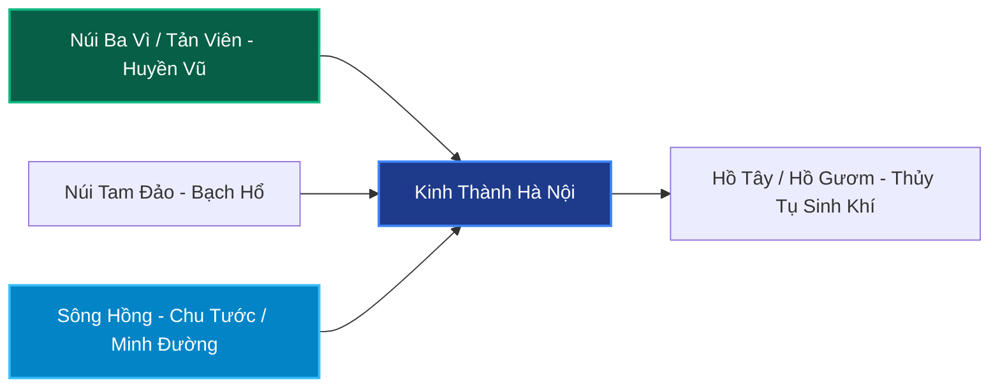

# Chương 2: Phân Tích Địa Khí & Phong Thủy Ba Miền Bắc - Trung - Nam

> **Khái quát:** Đi sâu phân tích sự khác biệt về địa tầng, khí hậu, hình thế sông núi và trường khí của 3 miền lãnh thổ. Khám phá phong thủy kinh thành Thăng Long - Hà Nội, cố đô Huế, thành phố biển Đà Nẵng, trung tâm kinh tế TP. Hồ Chí Minh và lực đẩy sân bay Long Thành.

---

## 1. Bắc Bộ - Vùng Đất Đế Đô Ngàn Năm & Trọng Tâm Quyền Lực

### 1.1. Thăng Long - Hà Nội: Thế Đất "Rồng Cuộn Hổ Ngồi"
Hơn một ngàn năm trước, trong bản *Chiếu dời đô (Thiên đô chiếu)* bất hủ năm 1010, vua Lý Thái Tổ đã đúc kết tinh hoa phong thủy của thành Đại La (Thăng Long - Hà Nội):
> *"Ở giữa khu vực trời đất, được thế rồng cuộn hổ ngồi, chính giữa nam bắc đông tây, tiện nghi núi sông sau trước. Vùng này mặt đất rộng mà bằng phẳng, thế đất cao mà sáng sủa, dân cư không khổ vì ngập lụt, muôn vật rất mực phong phú tốt tươi. Xem khắp nước Việt đó là nơi thắng địa, thực là chỗ hội tụ trọng yếu của bốn phương, đúng là nơi thượng đô kinh sư mãi muôn đời."*

Dưới lăng kính phong thủy địa lý hình pháp:
- **Hậu Chẩm (Huyền Vũ):** Núi **Ba Vì (Tản Viên Sơn)** cao vút ở phía Tây, nơi ngự trị của Đệ nhất Phúc thần Sơn Tinh, che chắn luồng khí khắc nghiệt và bảo trợ cho vận mệnh vương triều.
- **Tả Thanh Long:** Rặng núi hình cánh cung Đông Bắc (Tam Đảo, vòng cung Ngân Sơn, Đông Triều) bao bọc phía Tả.
- **Hữu Bạch Hổ:** Dải đồi bán sơn địa Hòa Bình, Ninh Bình hộ vệ phía Hữu.
- **Tiền Chu Tước (Minh Đường):** Dòng **Sông Hồng** đỏ nặng phù sa uốn lượn ôm trọn bờ đông bắc thành phố, kết hợp với hệ thống "thủy tụ" tự nhiên tuyệt mỹ: Hồ Tây (lá phổi khí dung hòa âm dương), Hồ Hoàn Kiếm (trái tim tâm linh lịch sử).

### 1.2. Đặc Tính Đồng Bằng Bắc Bộ: Đất Cổ Tụ Khí Thâm Sâu
- **Ưu điểm:** Khí trường ổn định, trầm tích văn hóa lâu đời, đất đai màu mỡ do phù sa tích tụ hàng thiên niên kỷ. Con người trọng đạo học, tính cách cẩn trọng, kỷ cương, thích hợp làm trung tâm đầu não hành chính, chính trị, giáo dục và công nghiệp công nghệ cao.
- **Nhược điểm:** Biên độ nhiệt trong năm rất lớn (mùa đông lạnh khô giá buốt, mùa hè nóng ẩm ngột ngạt). Vùng trũng dễ bị ngập úng nội thành khi mưa to kéo dài nếu hệ thống tiêu thoát nước đô thị không theo kịp tốc độ bê tông hóa.

---

## 2. Trung Bộ - Dải Đất Chuyển Tiếp & Vệt Sáng Ven Biển

### 2.1. Cố Đô Huế: Chuẩn Mực Phong Thủy Cung Đình Triều Nguyễn
Kinh thành Huế được các bậc thầy phong thủy triều Nguyễn quy hoạch theo một cấu trúc Tứ tượng vô cùng chặt chẽ và kinh điển:
- **Tiền Án:** Núi **Ngự Bình** (Bằng Sơn) có đỉnh bằng phẳng như bức bình phong tự nhiên che chắn trước mặt Hoàng thành.
- **Thanh Long & Bạch Hổ:** Hai cồn nổi tự nhiên trên sông Hương là **Cồn Hến** (Tả Thanh Long) và **Cồn Dã Viên** (Hữu Bạch Hổ) chầu vào Minh Đường.
- **Minh Đường Tụ Thủy:** Dòng **Sông Hương** chảy êm đềm, uốn khúc mềm mại như dải lụa xanh làm chậm dòng khí (*khúc tắc hữu tình*), giữ cho nguyên khí kinh kỳ không bị trôi tuột ra biển Thuận An.

### 2.2. Đà Nẵng: Thành Phố Biển Năng Động - Cực Tăng Trưởng Miền Trung
Đà Nẵng sở hữu một địa cuộc phong thủy hiếm có bậc nhất miền Trung:
- Tựa lưng vào rặng Trường Sơn hùng vĩ và đèo Hải Vân hiểm trở (Huyền Vũ trấn Bắc).
- Bán đảo **Sơn Trà** vươn dài ra biển như cánh tay rồng che chắn bão giông từ phía Đông Bắc.
- Dòng **Sông Hàn** chảy xuyên qua trung tâm đô thị đổ ra vịnh Đà Nẵng tạo thế "thủy thông vạn khoảnh".
- Phía Nam có danh thắng **Ngũ Hành Sơn** (Kim, Mộc, Thủy, Hỏa, Thổ) cân bằng ngũ hành linh khí. Đây là vùng đất hội tụ đầy đủ yếu tố "Sơn - Thủy - Hải - Đảo", có sức sống bứt phá mạnh mẽ về du lịch, kinh tế tri thức và dịch vụ cảng biển quốc tế.

### 2.3. Thách Thức Địa Khí Miền Trung
Trung Bộ là dải đất hẹp ngang, "đòn gánh hai đầu đất nước". Địa hình dốc đứng từ Tây sang Đông khiến sông ngòi ngắn và dốc (*thủy cấp tốc khứ, tài nan tụ* - nước chảy xiết khó giữ tiền của). Thêm vào đó, thời tiết khắc nghiệt (nắng hạn mùa hè với gió Lào rát bỏng, lũ lụt mùa đông) đòi hỏi quy hoạch kiến trúc phải ưu tiên hàng đầu tính bền vững, chống chịu thiên tai và tạo hồ trữ nước nhân tạo để điều hòa vi khí hậu.

---

## 3. Nam Bộ - Vùng Trù Phú, Thủy Sinh Phú Quý & Cực Kinh Tế

### 3.1. TP. Hồ Chí Minh: Thế Đất "Thủy Triều Tụ Tài"
Sài Gòn - TP. Hồ Chí Minh tọa lạc trên vùng đất chuyển tiếp từ bậc thềm phù sa cổ Đông Nam Bộ xuống đồng bằng phù sa mới:
- **Địa chất:** Khu vực trung tâm (Quận 1, Quận 3, Quận 10) nằm trên cốt nền cao ráo 5m - 10m so với mực nước biển, nền đất sét pha cát cổ rất vững chãi.
- **Thủy thế bao bọc:** Thành phố được ôm trọn bởi mạng lưới sông rạch chằng chịt: Sông Sài Gòn uốn lượn hình chữ U bao quanh bán đảo Thanh Đa và Thủ Thiêm, hợp lưu với sông Đồng Nai tạo thành thủy vực rộng lớn. 
- Trong phong thủy thương mại, nước lên xuống theo chế độ bán nhật triều của biển Đông chính là nhịp đập sinh khí đưa của cải, tàu bè tấp nập giao thương. Đây là lý do hơn 300 năm qua, Sài Gòn luôn là trung tâm thương nghiệp, tài chính và khởi nghiệp sôi động nhất cả nước.

### 3.2. Sân Bay Quốc Tế Long Thành (Đồng Nai): Cú Hích Chuyển Đổi Địa Khí
Sự xuất hiện của Siêu dự án Cảng hàng không quốc tế Long Thành trên vùng đất gò đồi bazan vững chắc huyện Long Thành (Đồng Nai) đang làm dịch chuyển trọng tâm phong thủy phát triển:
- Khởi kích hoạt trục năng lượng **Đông Nam Bộ:** Kết nối TP. Thủ Đức (TP.HCM) - Long Thành (Đồng Nai) - Phú Mỹ (Bà Rịa - Vũng Tàu).
- Chuyển hóa vùng gò đất cao phía Đông thành trung tâm trung chuyển hàng không toàn cầu (thuộc hành Kim và Hỏa vượng), cộng hưởng với thế xuất hải của cụm cảng nước sâu Cái Mép (hành Thủy vượng).

### 3.3. Đồng Bằng Sông Cửu Long: Thủy Thịnh - Sơn Khuyết
Đồng bằng Tây Nam Bộ là vựa lúa trù phú, đất đai do phù sa bồi đắp hàng năm. Tuy nhiên dưới góc độ phong thủy:
- **Thủy vượng tuyệt đỉnh:** Sông Tiền, sông Hậu và mạng lưới kinh rạch tạo nguồn nước tưới tiêu bất tận, nuôi dưỡng lòng nhân ái, tính cách phóng khoáng, lạc quan của cư dân.
- **Sơn khuyết:** Thiếu hoàn toàn các dãy núi đỡ lưng (ngoại trừ vùng Thất Sơn An Giang). Đất nền yếu, nguy cơ lún sụt và sạt lở bờ sông do biến đổi dòng chảy và khai thác cát quá mức.

---

## 4. Bảng So Sánh 3 Miền Qua 6 Tiêu Chí Phong Thủy Nền Tảng

| Tiêu Chí Phong Thủy | Bắc Bộ | Trung Bộ | Nam Bộ |
|:---|:---|:---|:---|
| **1. Cấu Trúc Hình Thế (Sơn - Thủy)** | Núi sông đan cài hoàn chỉnh; Núi non hùng vĩ phía Tây & Bắc, đồng bằng thoải dần ra vịnh Bắc Bộ. | Dãy núi Trường Sơn ép sát biển; Địa hình chia cắt sâu sắc, đồng bằng hẹp manh mún. | Đồi gò thoai thoải phía Đông Bắc (Đông Nam Bộ), đồng bằng bằng phẳng mênh mông phía Tây Nam. |
| **2. Độ Ổn Định Địa Tầng & Mạch Núi** | Địa tầng cổ rất ổn định; Mạch núi xuất phát từ Thái Tổ Sơn Côn Lôn - Fansipan kết tụ sâu dày. | Mạch núi dốc ngắn; Địa tầng đá vôi và hoa cương phân mảnh, dễ biến động sạt trượt mùa mưa. | Nền đất đỏ bazan cổ Đông Nam Bộ rất vững; Tây Nam Bộ là phù sa non yếu, dễ sụt lún cơ học. |
| **3. Thủy Mạch & Khả Năng Tụ Tài** | Sông Hồng dòng chảy chậm lại ở đồng bằng nhờ hệ thống đê điều; Tụ tài theo kiểu tích lũy bền bỉ. | Sông ngắn và dốc, nước chảy xiết ra biển; Tài khí dễ thất thoát nếu không có đập điều tiết. | Sông Cửu Long chia 9 cửa rồng, sông Sài Gòn uốn lượn; Thủy triều lên xuống tạo dòng tiền luân chuyển cực nhanh. |
| **4. Khí Hậu & Âm Dương Biến Dịch** | 4 mùa rõ rệt (Xuân - Hạ - Thu - Đông); Âm Dương thay đổi biên độ lớn, đòi hỏi con người bền bỉ thích nghi. | Khí hậu khắc nghiệt, chuyển mùa đột ngột; Nắng gắt bão dồn, tính chất khí trường mang tính thử thách cao. | 2 mùa mưa - nắng điều hòa; Nhiệt độ ổn định quanh năm, Dương khí dồi dào, thuận lợi phát triển kinh tế ngoài trời. |
| **5. Nhân Khí & Bản Sắc Văn Hóa** | Trọng lễ nghi, khuôn phép, chuộng học vị, quyền uy chính trị; Tích lũy tài sản an toàn (đất đai, vàng). | Kiên cường, chịu thương chịu khó, giàu ý chí vượt khó; Gắn bó tha thiết với cội nguồn và tâm linh. | Cởi mở, năng động, hào sảng, dám nghĩ dám làm; Ưa chuộng đầu tư kinh doanh, dòng tiền xoay vòng nhanh. |
| **6. Chu Kỳ Tăng Trưởng & Độ Bền Vững** | Tăng trưởng ổn định, trường cửu, khó bị suy thoái sâu nhờ nền tảng tích lũy chính trị - văn hóa. | Tăng trưởng theo các điểm sáng cục bộ (Đà Nẵng, Nha Trang, Quy Nhơn); Cần bảo vệ trước thiên tai. | Tốc độ bứt phá kinh tế dẫn đầu; Tính đàn hồi cao nhưng cần chú trọng chống ngập úng và xâm nhập mặn. |

---

## 5. Hàm Ý Đầu Tư Bất Động Sản Cho Từng Vùng Miền

### Miền Bắc:
- **Chiến lược:** Đầu tư vào các khu đô thị vệ tinh bám theo các trục vành đai (Vành đai 3.5, Vành đai 4 vùng Thủ đô), các thủ phủ công nghiệp có địa thế gò đồi vững chắc (Bắc Ninh, Bắc Giang, Hưng Yên, Vĩnh Phúc).
- **Loại hình ưu tiên:** Đất nền đô thị pháp lý minh bạch, bất động sản công nghiệp công nghệ cao, nhà ở gắn liền với chất lượng môi trường không khí trong lành.

### Miền Trung:
- **Chiến lược:** Nhắm vào các tọa độ có "Sơn bao Thủy bọc" kín gió ven biển như vịnh Đà Nẵng, vịnh Nha Trang, bán đảo Phương Mai (Quy Nhơn).
- **Loại hình ưu tiên:** Bất động sản nghỉ dưỡng chăm sóc sức khỏe (Wellness Sanctuary), đô thị sinh thái thích ứng biến đổi khí hậu, khu kinh tế ven biển gắn liền hạ tầng logistics cảng nước sâu.

### Miền Nam:
- **Chiến lược:** Đón đầu làn sóng giãn dân và chuyển dịch công nghiệp dọc trục hành lang kinh tế mới: Đông Nam Bộ (Long Thành, Biên Hòa, Bến Cát, Phú Mỹ) và hành lang ven sông Sài Gòn.
- **Loại hình ưu tiên:** Đại đô thị tích hợp (Township) đầy đủ tiện ích sinh thái, bất động sản kho bãi cảng biển, căn hộ cao tầng ven sông tại các vùng đất có cốt nền cao ráo chống ngập.

---
*Mỗi miền đất nước mang một bản mệnh và trường khí riêng biệt. Hiểu rõ quy luật địa khí từng miền là chìa khóa vàng để dựng xây cơ nghiệp và đầu tư đắc thắng.*
