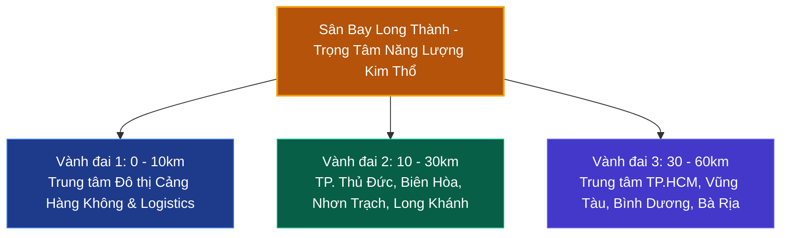

# Chương 3: Phong Thủy & Tác Động Trường Khí Các Công Trình Trọng Điểm Quốc Gia

> **Khái quát:** Đánh giá phong thủy các đại dự án hạ tầng quốc gia thế kỷ. Vai trò thông mạch của đường cao tốc Bắc - Nam, dòng năng lượng phi long sân bay Long Thành, địa đạo lưu khí của tuyến Metro và yếu tố thủy tụ tại cụm cảng quốc tế Cái Mép - Thị Vải.

---

## 1. Cảng Hàng Không Quốc Tế Long Thành: Điểm Tựa "Phi Long" & Bán Kính Tác Động

### 1.1. Địa Thế & Tọa Độ Tụ Khí
Cảng hàng không quốc tế Long Thành được quy hoạch trên diện tích 5.000 ha tại huyện Long Thành, tỉnh Đồng Nai. Dưới lăng kính phong thủy địa lý:
- **Cốt Nền "Thổ Vững Chấn Kim":** Long Thành nằm trên vùng đồi bazan cổ có cao độ tự nhiên từ 15m đến 35m so với mực nước biển. Đây là nền địa chất vô cùng vững chãi, không bao giờ phải đối mặt với nguy cơ sụt lún hay triều cường ngập nước - một tiêu chí tối thượng cho công trình thế kỷ.
- **Hội Tụ Ngũ Hành Kim - Thổ - Hỏa:** Ngành hàng không đại diện cho hành **Kim** (máy bay kim khí bay lượn trên trời) và hành **Hỏa** (nhiên liệu phản lực, động lực vút bay). Đặt trên nền đất bazan đỏ au dồi dào nguyên tố vi lượng thuộc hành **Thổ** tạo thành chuỗi tương sinh hoàn hảo: **Hỏa sinh Thổ -> Thổ sinh Kim**.

### 1.2. Bán Kính Tác Động Trường Khí
- **Bán kính 10 km (Vùng lõi năng lượng cao):** Hình thành mô hình "Thành phố sân bay" (Aerotropolis). Dòng người và hàng hóa tạo ra luồng nhân khí cực thịnh, thúc đẩy các trung tâm triển lãm, dịch vụ tài chính quốc tế, khách sạn hạng sang và kho bãi ngoại quan thông minh.
- **Bán kính 30 km (Vành đai vệ tinh cộng hưởng):** Kết nối trực tiếp khu đô thị mới Thủ Thiêm, trung tâm Biên Hòa và khu công nghệ cao TP. Thủ Đức, tạo thành trục tam giác vàng sinh khí phía Nam.
- **Bán kính 60 km (Vùng lan tỏa tài lộc):** Kích hoạt toàn diện bất động sản công nghiệp Bình Dương, logistics cảng biển Bà Rịa - Vũng Tàu và du lịch nghỉ dưỡng ven biển.

---

## 2. Tuyến Đường Cao Tốc Bắc - Nam: Huyết Mạch Nối Liền "Xương Sống Rồng"

### 2.1. Quan Niệm Phong Thủy: "Lộ Vi Hư Thủy"
Trong phong thủy học thực hành:
> *"Đại lộ thông thương vi Thủy lộ, xa mã như lưu thị Thủy triều."*  
> (Đường lớn thông suốt được coi là dòng sông cạn dẫn khí; Xe cộ nườm nượp qua lại tựa như dòng triều lưu chuyển không ngừng).

Trước đây, dải đất miền Trung bị chia cắt cục bộ bởi các dãy núi đâm ngang ra biển (đèo Ngang, đèo Cù Mông, đèo Cả, đèo Hải Vân), khiến sinh khí giữa các thung lũng bị ứ trệ, kinh tế địa phương manh mún. 

### 2.2. Khai Thông Huyết Mạch Quốc Gia
Tuyến đường bộ cao tốc Bắc - Nam phía Đông kéo dài từ Cao Bằng qua Lạng Sơn đến tận mũi Cà Mau như một dòng đại sinh khí nhân tạo chạy song hành cùng dãy Trường Sơn:
- Đục thông các hầm đèo hiểm trở (Hầm Đèo Cả, Cù Mông, Hải Vân, Tam Điệp...), biến trở ngại địa hình thành đường dẫn khí thẳng thớm, êm thuận.
- Các **Nút Giao Cắt (Interchange - IC):** Nơi các dòng đường hội tụ và rẽ nhánh được ví như các **"Thủy Tụ Minh Đường"**. Khu đất nằm cách nút giao cao tốc từ 1 - 3 km luôn đón nhận luồng tài khí mạnh mẽ, lý tưởng để hình thành các cụm công nghiệp, tổng kho logistics và trung tâm thương mại dịch vụ quy mô lớn.

---

## 3. Hệ Thống Tuyến Metro Hà Nội & TP. Hồ Chí Minh: Dòng Địa Khí Ngầm Đô Thị

### 3.1. Địa Đạo Lưu Khí Trong Lòng Đất
Tuyến đường sắt đô thị (Metro) vận hành cả trên cao lẫn đi ngầm sâu trong lòng đất đô thị:
- **Tác động địa tầng:** Việc thi công hầm ngầm bằng khiên đào TBM hiện đại giảm thiểu tối đa sự đứt gãy mạch đất. Về mặt năng lượng, dòng tàu điện vận hành liên tục bằng năng lượng điện sạch kích hoạt dòng ion trong lòng đất, giải phóng các vùng khí tù hãm lâu ngày dưới các khối bê tông đặc quánh của đô thị cũ.
- **Nhân Khí Hội Tụ:** Mỗi nhà ga Metro trung tâm (như ga Bến Thành, ga Nhà hát Thành phố tại TP.HCM hay ga Cát Linh, ga Hà Nội tại Thủ đô) mỗi ngày đón hàng chục vạn lượt hành khách di chuyển. Dòng người này mang theo **Dương khí dồi dào**, làm bừng sáng và hồi sinh toàn bộ không gian kinh doanh ngầm xung quanh ga.

### 3.2. Mô Hình TOD (Transit-Oriented Development) & Phong Thủy Đô Thị
Phát triển đô thị lấy định hướng giao thông công cộng làm trung tâm (TOD) chính là sự ứng dụng tuyệt hảo của nguyên lý phong thủy: nén mật độ dân cư vào các điểm tụ khí giao thông, nhường không gian mặt đất cho công viên, mặt nước và cây xanh để hoàn lưu sinh khí.

---

## 4. Cụm Cảng Nước Sâu Cái Mép - Thị Vải: Hải Môn Tụ Thủy Quốc Tế

### 4.1. Vị Thế Hải Môn Tuyệt Đỉnh
Cụm cảng Cái Mép - Thị Vải (tỉnh Bà Rịa - Vũng Tàu) nằm tại cửa sông Thị Vải đổ ra vịnh Gành Rái:
- **Luồng hàng hải tự nhiên lý tưởng:** Độ sâu trước bến lên tới -14m đến -16,5m, cho phép các siêu tàu mẹ trọng tải trên 200.000 tấn đi thẳng sang bờ Tây nước Mỹ và châu Âu mà không cần trung chuyển qua Singapore hay Malaysia.
- **Thế Đất Bao Bọc:** Phía Tây có rừng ngập mặn Cần Giờ đóng vai trò bình phong chắn sóng gió; Phía Đông và Nam có dãy núi Thị Vải và dãy núi Nhỏ, núi Lớn Vũng Tàu ôm ấp, tạo nên một vụng nước sâu kín gió, sóng êm - đúng chuẩn thế đất **"Tàng phong tụ khí"** bậc nhất của ngành hàng hải.

### 4.2. Thủy Tụ Sinh Tài
Sự kết hợp giữa sông sâu và biển cả tại Cái Mép hình thành nên một **"Hải Khẩu Tụ Bảo Bồn"** (Bát gom của cải nơi cửa biển), biến vùng đất Phú Mỹ - Tân Thành xưa kia thành trung tâm công nghiệp nặng, hóa chất, thép và dịch vụ cảng biển sôi động hàng đầu Đông Nam Á.

---

## 5. Bảng Thẩm Định Phong Thủy 8 Đại Dự Án Hạ Tầng Quốc Gia

| STT | Tên Công Trình / Dự Án | Vị Trí Địa Lý | Hành Phong Thủy Chủ Đạo | Đánh Giá Thế Đất & Dòng Khí | Tác Động Kinh Tế & Bất Động Sản |
|:---:|:---|:---|:---:|:---|:---|
| **1** | **Cảng Hàng Không QT Long Thành** | Long Thành, Đồng Nai | **Kim - Thổ** | Đồi bazan cao ráo, vững như bàn thạch, đón khí bốn phương, thoát nước hoàn hảo. | Trở thành cực hút vốn FDI, biến vùng Đông Nam Bộ thành trung tâm công nghiệp - dịch vụ số 1. |
| **2** | **Đại Lộ Cao Tốc Bắc - Nam Phía Đông** | Xuyên suốt chiều dài đất nước | **Thủy** *(Hư thủy dẫn khí)* | Khai thông huyết mạch Trường Sơn, xóa bỏ thế cô lập của các vùng trũng miền Trung. | Tăng giá trị đất đai tại các nút giao, mở rộng bán kính đô thị hóa các tỉnh dọc tuyến. |
| **3** | **Metro Tuyến 1 Bến Thành - Suối Tiên** | TP. Hồ Chí Minh | **Thủy - Mộc** | Chạy dọc hành lang Đông Bắc TP.HCM, kết nối trung tâm lịch sử với TP. Thủ Đức sáng tạo. | Thúc đẩy các đại đô thị nén quanh các ga rải rác từ Bình Thạnh đến Thủ Đức và Dĩ An. |
| **4** | **Metro Tuyến Cát Linh - Hà Đông & Nhổn** | Hà Nội | **Thủy - Hỏa** | Nối lõi trung tâm Ba Đình - Hoàn Kiếm với vùng đô thị mở rộng phía Tây và Nam sông Hồng. | Tái cấu trúc thói quen dịch chuyển của cư dân Thủ đô, nâng cao giá trị căn hộ dọc tuyến. |
| **5** | **Cụm Cảng Quốc Tế Cái Mép - Thị Vải** | TX. Phú Mỹ, Bà Rịa - Vũng Tàu | **Thủy** *(Đại thủy tụ khí)* | Cửa sông sâu tự nhiên kín gió, có rừng ngập mặn che chắn, thế nước êm đềm tụ lộc. | Bất động sản công nghiệp, kho bãi logistics, khu dịch vụ hậu cần cảng bùng nổ bền vững. |
| **6** | **Cảng Hàng Không QT Vân Đồn & Cao Tốc Hạ Long - Móng Cái** | Quảng Ninh | **Kim - Thủy** | Lưng tựa núi đồi Cô Tô - Tiên Yên, mặt hướng vịnh Bái Tử Long kỳ vĩ, khai phóng biển cả. | Tạo hành lang kinh tế mậu dịch biên giới Việt - Trung hùng mạnh, bất động sản nghỉ dưỡng biển. |
| **7** | **Cầu Mỹ Thuận 2 & Cao Tốc Cần Thơ - Cà Mau** | Miền Tây Nam Bộ | **Thủy** *(Giao thủy thông lộ)* | Vượt qua dòng đại giang sông Tiền, sông Hậu, bắc nhịp sinh khí về tận đất Mũi Cà Mau. | Phá vỡ sự phụ thuộc phà đò, thúc đẩy logistics nông thủy sản và đô thị sông nước Miền Tây. |
| **8** | **Trung Tâm Tài Chính Quốc Tế Thủ Thiêm** | TP. Thủ Đức, TP.HCM | **Thổ - Thủy** | Bán đảo hình móng ngựa ôm trọn bởi sông Sài Gòn, đối diện bờ Tây Quận 1 hoa lệ. | Trở thành "Phố Wall" của Việt Nam, định vị phân khúc bất động sản tài chính hạng sang cao cấp nhất. |

---
*Các đại dự án hạ tầng quốc gia chính là công cụ của con người tham gia cải tạo địa mạo, dẫn dắt long mạch và kiến tạo nên những chu kỳ phồn vinh rực rỡ cho đất nước.*
