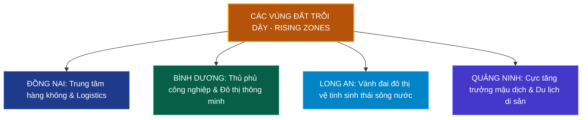

# Chương 4: Xu Hướng Phát Triển & Bản Đồ Vượng Khí Các Vùng Đất Mới

> **Khái quát:** Phân loại và định vị trường khí của các vùng đất trên toàn quốc. Nhận diện các vùng đất trỗi dậy (Rising Zones), các vùng đất đế vương ổn định trường tồn (Stable Zones) và những tọa độ rủi ro cần cẩn trọng quan sát (Watch Zones).

---

## 1. Vùng Đất Trỗi Dậy (Rising Zones) - Sức Bật Từ Hạ Tầng & Thiên Thời

Vùng đất trỗi dậy là những khu vực hội tụ đủ ba yếu tố: **Thiên thời** (đón đầu chu kỳ quy hoạch kinh tế vĩ mô), **Địa lợi** (địa tầng ổn định, hạ tầng kết nối vượt bậc), và **Nhân hòa** (thu hút dòng vốn đầu tư và di dân cơ học mạnh mẽ).

### 1.1. Đồng Nai: Thế Đất "Đồi Cao Nghênh Hải Khí"
- **Đặc trưng địa khí:** Phần lớn diện tích Đồng Nai là vùng đất gò đồi bazan và phù sa cổ cao ráo (Biên Hòa, Long Thành, Thống Nhất), chịu tải trọng xây dựng cực tốt.
- **Dòng sinh khí mới:** Sự kết hợp đồng bộ giữa Sân bay Long Thành, Cao tốc Biên Hòa - Vũng Tàu, Cao tốc Dầu Giây - Phan Thiết tạo nên mạng lưới dẫn khí đa tầng. Vùng đất này đang vươn lên thành tâm điểm đón nhận dòng vốn FDI công nghiệp công nghệ cao và logistics lớn nhất khu vực phía Nam.

### 1.2. Bình Dương: Địa Tầng Granite Ổn Định & Quy Hoạch Bàn Cờ
- **Đặc trưng địa khí:** Cốt nền địa chất đá granite phong hóa tạo nên tầng đất cứng vững chắc, địa hình bằng phẳng lượn sóng nhẹ, tuyệt đối không ngập lụt.
- **Hình thế phong thủy:** Bình Dương tiên phong phát triển hệ sinh thái công nghiệp - đô thị theo cấu trúc mạng lưới giao thông ô bàn cờ chuẩn mực (Đại lộ Bình Dương, Mỹ Phước - Tân Vạn). Hình thế ô bàn cờ giúp dòng sinh khí lưu chuyển đều khắp, không bị tụ đọng khí xấu, kiến tạo nên môi trường sống và làm việc ngăn nắp, giàu năng lượng phát triển.

### 1.3. Long An: Châu Thổ Vàm Cỏ Đón Nhận Khí Giãn Dân
- **Đặc trưng địa khí:** Nằm tại vùng bản lề kết nối Đông Nam Bộ với Tây Nam Bộ. Hệ thống sông Vàm Cỏ Đông và Vàm Cỏ Tây uốn lượn hiền hòa mang phù sa và dòng nước ngọt mát lành.
- **Tiềm năng:** Khu vực Bến Lức, Đức Hòa, Cần Giuộc giáp ranh TP.HCM đang trỗi dậy mạnh mẽ nhờ mô hình các đại đô thị sinh thái ven sông. Yếu tố "Thủy bọc" tự nhiên giúp thanh lọc không khí, là điểm đến lý tưởng cho cư dân đô thị tìm kiếm không gian sống cân bằng, hòa hợp thiên nhiên.

---

## 2. Vùng Đất Ổn Định Trường Tồn (Stable Zones) - Đế Vương & Trung Tâm Cốt Lõi

Đây là những vùng đất có địa khí sâu dày, đã được chứng minh qua hàng trăm năm lịch sử, luôn duy trì sức hút cao nhất và là nơi an cư lý tưởng của giới tinh hoa.

### 2.1. Hà Nội: Vùng Đất Ba Đình - Tây Hồ - Hoàn Kiếm
- **Ba Đình (Trung tâm quyền lực quốc gia):** Thế đất tựa núi Tản Viên, mặt hướng sông Hồng, trường khí uy nghiêm, tĩnh tại và tôn quý bậc nhất. Bất động sản tại đây không bao giờ mất giá do tính chất độc bản và sự hội tụ của các cơ quan đầu não Trung ương.
- **Tây Hồ (Vùng linh khí tụ thủy):** Hồ Tây rộng hơn 500 ha được mệnh danh là chiếc túi chứa ngọc của đất Thăng Long. Dòng khí mát lành từ hồ kết hợp với dải đất bán đảo Quảng An tạo nên môi trường sống phong thủy đắc tài đắc lộc, thu hút cộng đồng chuyên gia quốc tế và các doanh nhân thành đạt.

### 2.2. TP. Hồ Chí Minh: Trục Lõi Quận 1, Quận 3 & Khu Đô Thị Nam Sài Gòn (Quận 7)
- **Quận 1 - Quận 3 (Lõi lịch sử đất gò):** Nằm trọn vẹn trên dải đất phù sa cổ cao ráo (cốt nền 6m - 10m), được bao bọc bởi hàng cây cổ thụ xanh mát trăm tuổi dọc theo đường Lê Duẩn, Pasteur, Trương Định. Thế đất tĩnh tại giữa lòng đô thị náo nhiệt, giữ vững giá trị thương mại và ngoại giao qua nhiều thế kỷ.
- **Quận 7 - Phú Mỹ Hưng (Quy hoạch thủy cảnh đỉnh cao):** Dù xuất phát điểm là vùng đất trũng Nhà Bè xưa, Phú Mỹ Hưng đã vận dụng xuất sắc triết lý quy hoạch phong thủy hiện đại: tôn tạo hệ thống kênh rạch tự nhiên (sông Thầy Tiêu, rạch Đĩa) thành công viên mặt nước uốn lượn, thiết lập không gian sống chuẩn mực sinh thái cho cộng đồng văn minh.

---

## 3. Vùng Đất Cần Cẩn Trọng Quan Sát (Watch Zones)

Phong thủy học chân chính luôn đề cao nguyên tắc **"Tỵ hung xu cát"** (Tránh nơi hung hiểm, tìm đến nơi cát lành). Khi đánh giá đất đai, nhà đầu tư cần nhận diện rõ các vùng đất có trường khí bất ổn định do thiên nhiên tác động:

### 3.1. Vùng Đất Trũng Thấp & Thường Xuyên Ngập Nước Đô Thị
- **Khu vực:** Vùng trũng Tây Nam TP.HCM (một số xã trũng thuộc Bình Chánh, Quận 8 ven kênh), các khu vực ven sông Hồng ngoài đê quai tại Hà Nội khi vào mùa xả lũ.
- **Đánh giá phong thủy:** Đất úng thủy dài ngày tạo nên **"Thủy tụ biến thành Trọc thủy"** (nước ứ đọng biến chất thành nước bẩn), sinh ra khí ẩm thấp (Âm sát), hao tổn sức khỏe đường hô hấp của cư dân và gây cản trở sinh hoạt thường nhật.
- **Hóa giải:** Cần đầu tư chi phí lớn để nâng cao cốt nền nhà ở, làm tầng hầm chống thấm chuyên dụng và ưu tiên hệ thống thoát nước tuần hoàn tự nhiên.

### 3.2. Vùng Bờ Sông & Duyên Hải Sạt Lở Nghiêm Trọng
- **Khu vực:** Ven bờ sông Tiền, sông Hậu tại các khúc cong dòng chảy (An Giang, Đồng Tháp, Cà Mau), các dải bờ biển thiếu rừng ngập mặn phòng hộ tại Miền Trung.
- **Đánh giá phong thủy:** Đây là hiện tượng **"Cắt Cước Sát"** và **"Phản Cung Thủy"** cực nặng: dòng nước chảy xiết va đập trực tiếp vào bờ đất làm cuốn trôi long mạch, đất đai sụp đổ khiến tài sản tan biến trong gang tấc. Tuyệt đối không đầu tư xây dựng công trình cố định trên các mép nước có dấu hiệu nứt nẻ sạt trượt.

---

## 4. Bảng Đánh Giá 10 Vùng Đất Trọng Điểm Việt Nam

| STT | Vùng Đất / Địa Bàn | Phân Loại Vùng | Cấu Trúc Địa Khí & Ngũ Hành | Điểm Phong Thủy (1-10) | Tiềm Năng Đầu Tư | Khuyến Nghị Chiến Lược |
|:---:|:---|:---:|:---|:---:|:---:|:---|
| **1** | **Ba Đình - Tây Hồ (Hà Nội)** | **Stable Zone** | Mạch cổ Tản Viên hội tụ Hồ Tây; Ngũ Hành: **Thủy - Mộc vượng**. | **9.8** | Rất cao *(Bền vững)* | Giữ tài sản lâu dài, văn phòng ngoại giao, căn hộ dịch vụ cao cấp. |
| **2** | **Đông Anh - Gia Lâm (Hà Nội)** | **Rising Zone** | Đất bãi bồi trù phú phía Bắc sông Hồng; Ngũ Hành: **Thổ - Kim**. | **8.8** | Xuất sắc | Đón đầu cầu Tứ Liên, Trần Hưng Đạo; Đô thị thông minh, sinh thái. |
| **3** | **Quận 1 & Bến Nghé (TP.HCM)** | **Stable Zone** | Gò phù sa cổ cao ráo, sông Sài Gòn bao bọc; Ngũ Hành: **Kim - Thủy**. | **9.5** | Rất cao *(Thanh khoản cao)* | Trụ sở tập đoàn, khách sạn 5 sao, thương mại bán lẻ hạng sang. |
| **4** | **Bán Đảo Thủ Thiêm (TP.HCM)** | **Rising / Stable** | Minh đường móng ngựa ôm sông Sài Gòn; Ngũ Hành: **Thổ dưỡng Thủy**. | **9.6** | Đỉnh cao *(Tài chính quốc tế)* | Căn hộ hạng sang, cao ốc tài chính, biểu tượng kiến trúc quốc gia. |
| **5** | **Long Thành (Đồng Nai)** | **Rising Zone** | Đồi bazan vững chắc, trung tâm hàng không; Ngũ Hành: **Kim - Thổ**. | **9.2** | Rất mạnh *(Bùng nổ)* | Bất động sản công nghiệp, kho vận logistics, đô thị dịch vụ sân bay. |
| **6** | **Dĩ An - Thuận An (Bình Dương)** | **Rising Zone** | Nền đá granite cứng, quy hoạch ô bàn cờ; Ngũ Hành: **Kim - Hỏa**. | **8.7** | Cao *(Dòng tiền tốt)* | Căn hộ vừa túi tiền phục vụ kỹ sư, chuyên gia khu công nghiệp. |
| **7** | **Bến Lức - Cần Giuộc (Long An)** | **Rising Zone** | Phù sa Vàm Cỏ êm đềm, ven sông thoáng đãng; Ngũ Hành: **Thủy - Mộc**. | **8.5** | Khá cao | Khu đô thị sinh thái sông nước khép kín, nhà phố biệt thự vườn. |
| **8** | **Sơn Trà & Ngũ Hành Sơn (Đà Nẵng)** | **Stable / Rising** | Sơn Thủy tương giao, thế đất Ngũ Hành cân đối; Ngũ Hành: **Đủ 5 Hành**. | **9.0** | Cao *(Du lịch dịch vụ)* | Nghỉ dưỡng biển, trung tâm công nghệ thông tin và tài chính miền Trung. |
| **9** | **Bán Đảo Cam Ranh (Khánh Hòa)** | **Rising Zone** | Cát trắng tự nhiên, vịnh nước sâu kín gió; Ngũ Hành: **Thủy - Kim**. | **8.6** | Tiềm năng dài hạn | Resort biển tiêu chuẩn quốc tế, đô thị du lịch giải trí quy mô lớn. |
| **10** | **Vùng Trũng Sạt Lở Bờ Sông ĐBSCL** | **Watch Zone** | Đất phù sa non yếu, xói lở dòng xiết; Ngũ Hành: **Thủy khắc Thổ**. | **4.2** | Rủi ro cao | Tuyệt đối tránh xây công trình kiên cố ven mép nước; Di dời an toàn. |

---
*Nắm bắt bản đồ vượng khí giúp nhà đầu tư nhìn thấu chu kỳ vận động của dòng tiền, lựa chọn đúng tọa độ thiên thời địa lợi để nhân bội thành quả.*
