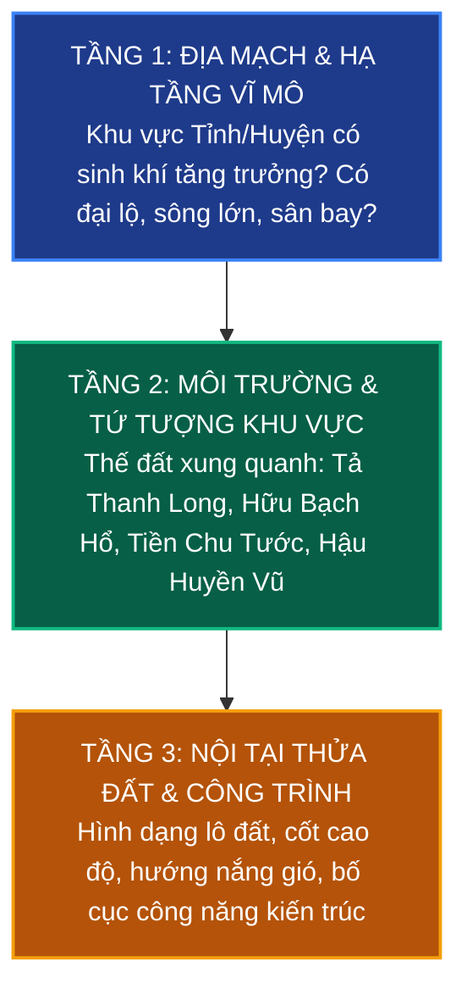

# Chương 5: Ứng Dụng Phong Thủy Quốc Gia Vào Thẩm Định Đầu Tư & Xây Dựng

> **Khái quát:** Chuyển hóa lý thuyết phong thủy địa lý vĩ mô thành phương pháp luận thực chiến trong thẩm định bất động sản và lựa chọn khu đất. Bộ quy tắc 10 tiêu chí kiểm tra, ma trận đối chiếu phong thủy với pháp lý và khung mẫu ra quyết định đầu tư an toàn.

---

## 1. Phương Pháp Luận Đánh Giá Đất "Top-Down" (Từ Vĩ Mô Đến Vi Mô)

Sai lầm phổ biến nhất của người mua đất hay nhà đầu tư nghiệp dư là chỉ chăm chú nhìn vào chiếc la bàn xem hướng cửa nhà có hợp tuổi gia chủ hay không (vi mô cực đoan) mà bỏ qua hoàn toàn bức tranh địa thế tổng thể xung quanh. Một khu đất nằm ở vùng đứt gãy sạt lở hay trũng ngập thì dù hướng cửa có tuyệt hảo đến đâu cũng không thể mang lại an cư lạc nghiệp.

Quy trình thẩm định chuẩn xác phải tuân thủ nghiêm ngặt **3 tầng phân tích từ trên xuống dưới**:



- **Tầng 1 - Cấp độ Vĩ mô:** Phân tích khu đất nằm trong vùng nào (Rising, Stable hay Watch Zone)? Có đón nhận luồng sinh khí từ trục giao thông huyết mạch hay hạ tầng quốc gia mới hay không?
- **Tầng 2 - Cấp độ Khu vực:** Quan sát cảnh quan bán kính 500m - 1km. Phía sau có điểm tựa vững chãi không? Phía trước có bị che chắn tầm nhìn bởi khối bê tông bức bối hay bãi rác, nghĩa trang không?
- **Tầng 3 - Cấp độ Thửa đất:** Xem xét hình học mảnh đất (nở hậu, vuông vức hay thóp hậu), hướng tiếp cận của ngõ/đường, hướng gió mát và ánh nắng tự nhiên.

---

## 2. Bộ Quy Tắc 10 Tiêu Chí (10-Point Checklist) Thẩm Định Bất Động Sản Thực Chiến

Khi bước chân tới khảo sát một bất động sản thực tế, hãy chấm điểm dựa trên bộ 10 tiêu chí sau:

| STT | Tiêu Chí Kiểm Tra | Biểu Hiện Phong Thủy Đắc Lợi (Cát Tướng) | Biểu Hiện Hung Hiểm (Cần Tránh Hoặc Hóa Giải) | Điểm Tối Đa |
|:---:|:---|:---|:---|:---:|
| **1** | **Cốt nền & Địa mạo** | Đất cao ráo, thooát nước nhanh, không khí khô ráo, nền móng cứng cáp. | Đất sình lầy, trũng sâu hơn mặt đường, mùi ẩm mốc bốc lên. | **10** |
| **2** | **Hình dáng thửa đất** | Hình vuông, chữ nhật tỉ lệ vàng (1:1.5 đến 1:2), hoặc thế đất **nở hậu** nhẹ. | Đất hình tam giác nhọn (Hỏa hình sát), đất chữ L xẻ nách, đất **thóp hậu** nặng. | **10** |
| **3** | **Minh đường trước mặt** | Phía trước rộng rãi, khoáng đạt, có sân hoặc khoảng lùi đón ánh sáng mặt trời. | Trước mặt có cây to chết khô án ngữ, cột điện biến áp cao thế, bức tường đen che kín. | **10** |
| **4** | **Hậu chẩm (Thế tựa lưng)** | Phía sau có tòa nhà bề thế, đồi gò cao vững chắc che chở (thế Huyền Vũ). | Phía sau đất là vực thẳm sâu hoắm, cống thoát nước thải lộ thiên hôi thối. | **10** |
| **5** | **Thủy mạch bao bọc** | Có hồ nước trong xanh điều hòa, dòng sông uốn khúc nhẹ nhàng ôm lấy khu đất. | Sông ngòi chảy xiết đâm thẳng vào bờ (phản cung thủy), kênh mương nước đen tù đọng. | **10** |
| **6** | **Khí lộ giao thông** | Đường phía trước uốn cong êm đềm, xe cộ lưu thông vừa phải, vỉa hè rộng. | Ngã ba đường đâm thẳng tâm cửa chính (**Thương sát**), đường kẹp hông xẻ khí. | **10** |
| **7** | **Láng giềng & Âm sát** | Khu dân cư dân trí cao, hòa nhã, cây cối xanh tươi phát triển tốt tươi. | Sát vách nghĩa trang, nhà tang lễ, lò mổ, bãi rác tập kết ô nhiễm nặng nề. | **10** |
| **8** | **Khí hậu & Vi khí hậu** | Đón gió Đông Nam hoặc Nam mát rượi vào mùa hè; Có tường che chắn gió bấc mùa đông. | Hướng chính Tây chịu nắng thiêu đốt quanh năm, không có giải pháp che nắng tự nhiên. | **10** |
| **9** | **Lịch sử mảnh đất** | Đất thổ cư lâu đời của gia đình êm ấm, đất đồn điền nông nghiệp trù phú xưa. | Đất từng xảy ra hỏa hoạn tang thương dữ dội, đất vũng lầy chôn lấp rác hóa chất. | **10** |
| **10** | **Cảm ứng trường khí** | Khi bước vào khu đất cảm thấy thư thái, tinh thần sảng khoái, muốn nán lại lâu. | Bước vào cảm thấy ớn lạnh sống lưng, nặng đầu, bồn chồn khó thở không rõ nguyên do. | **10** |

> **Thang điểm thẩm định:**
> - **Từ 85 - 100 điểm:** Khu đất đại cát, tụ tài tích đức, biên độ tăng trưởng và an cư xuất sắc.
> - **Từ 65 - 84 điểm:** Khu đất khá tốt, một vài khuyết điểm nhỏ có thể hóa giải dễ dàng bằng giải pháp kiến trúc.
> - **Dưới 65 điểm:** Khu đất có nhiều lỗi phong thủy nặng, chi phí khắc phục lớn, nên cân nhắc kỹ trước khi xuống tiền.

---

## 3. Phối Hợp Giữa Thẩm Định Phong Thủy & Pháp Lý Xây Dựng

Một mảnh đất dù được thầy phong thủy khen ngợi "đắc địa long mạch" đến đâu nhưng nếu vướng tranh chấp pháp lý hoặc nằm trong quy hoạch giải tỏa thì toàn bộ sinh khí đó cũng trở nên vô nghĩa. Ngược lại, một khu đất chuẩn pháp lý nhưng phong thủy phạm sát nặng nề cũng sẽ gây bất an cho người cư ngụ.

### Ma Trận Kết Hợp: Phong Thủy vs Pháp Lý
```
                         PHÁP LÝ RÕ RÀNG (Sổ đỏ sẵn sàng)
                                       ▲
                                       │
                [CẦN CẢI TẠO]          │          [VIÊN KIM CƯƠNG]
          Phong thủy có lỗi nhẹ         │      Phong thủy đắc địa tụ tài
          Nhưng pháp lý chuẩn chỉnh      │      Pháp lý hoàn toàn sạch sẽ
          ==> Mua & thiết kế kiến trúc   │      ==> XUỐNG TIỀN NGAY LẬP TỨC!
                                       │
   ◄───────────────────────────────────┼───────────────────────────────────►
   PHONG THỦY XẤU                      │                     PHONG THỦY ĐẸP
   (Phạm sát nặng, khó hóa giải)       │                     (Tứ tượng hoàn hảo)
                                       │
                [TUYỆT ĐỐI BỎ QUA]     │          [CẠM BẪY NGUY HIỂM]
          Phong thủy cực xấu           │      Thế đất rất đẹp, giá rất hời
          Pháp lý tranh chấp dở dang   │      Nhưng dính quy hoạch treo
          ==> RỦI RO MẤT TRẮNG         │      ==> KHÔNG ĐƯỢC CHẠM VÀO!
                                       │
                                       ▼
                     PHÁP LÝ RỦI RO (Quy hoạch, tranh chấp)
```

---

## 4. Xử Lý Xung Đột Giữa Phong Thủy & Nhu Cầu Thực Tế

Trong thực tế xây dựng hiện đại, rất nhiều gia chủ rơi vào trạng thái bế tắc vì phong thủy cổ điển xung đột với nhu cầu tiện nghi:
1. **Xung đột hướng nhà hợp tuổi vs Hướng View / Hướng Gió:**
   - *Ví dụ:* Gia chủ mệnh Đông Tứ Mệnh (hợp hướng Đông, Đông Nam) nhưng mảnh đất mặt tiền duy nhất quay hướng Tây nhìn ra công viên hoặc bờ hồ lộng gió.
   - *Giải pháp:* Vẫn mở rộng tầm view hướng Tây ra cảnh quan bằng hệ kính hộp cản nhiệt Low-E hai lớp và lam chắn nắng thông minh. Cửa chính có thể mở lệch hướng, hoặc điều chỉnh vị trí đặt bếp nấu và bàn làm việc quay về các phương vị Sinh Khí, Diên Niên của gia chủ để bù đắp.
2. **Xung đột công năng vệ sinh khép kín:**
   - Cổ thư kiêng kỵ đặt nhà vệ sinh trong phòng ngủ hoặc gần bếp. Nhưng kiến trúc hiện đại đòi hỏi tính riêng tư cao.
   - *Giải pháp:* Vẫn bố trí nhà vệ sinh khép kín nhưng lắp đặt hệ thống quạt hút thông gió cưỡng bức công suất cao, tạo khoảng đệm ngăn mùi bằng tủ quần áo hoặc vách kính mờ, tuyệt đối không để cửa nhà vệ sinh chiếu thẳng vào đầu giường ngủ.

---

## 5. Khung Mẫu Ra Quyết Định Đầu Tư (Decision-Making Framework)

Áp dụng bảng tính trọng số khi cân nhắc mua bất động sản:

| Yếu Tố Đánh Giá | Trọng Số | Thang Điểm (1-10) | Điểm Quy Đổi | Tiêu Chí Đánh Giá Chi Tiết |
|:---|:---:|:---:|:---:|:---|
| **Pháp lý bất động sản** | **30%** | X | 0.3 * X | Sổ đỏ lâu dài (10đ); Sổ 50 năm (7đ); Đang chờ sổ (4đ); Tranh chấp (0đ). |
| **Vị trí & Địa thế phong thủy** | **25%** | Y | 0.25 * Y | Đạt chuẩn 10-Point Checklist phong thủy (Cốt nền cao, nở hậu, minh đường sáng). |
| **Hạ tầng giao thông kết nối** | **20%** | Z | 0.2 * Z | Gần trục cao tốc, vành đai, tuyến metro, đường rộng xe ô tô tránh nhau thoải mái. |
| **Tiềm năng sinh lời & Thanh khoản** | **15%** | M | 0.15 * M | Biên độ tăng giá trong 3-5 năm, nhu cầu thuê và mua lại tại khu vực cao. |
| **Giá cả so với thị trường** | **10%** | N | 0.1 * N | Rẻ hơn 5-10% giá mặt bằng chung (10đ); Bằng thị trường (7đ); Ngáo giá (3đ). |
| **TỔNG ĐIỂM CHUNG** | **100%** | | **TỔNG** | **Hành động: >= 8.0: Mua ngay; 6.5 - 7.9: Đàm phán giảm giá; < 6.5: Bỏ qua.** |

---
*Đầu tư bất động sản thành công là sự kết tinh của tư duy khoa học duy lý, am hiểu pháp lý tường tận và cảm thụ nhạy bén về địa khí đất trời.*
