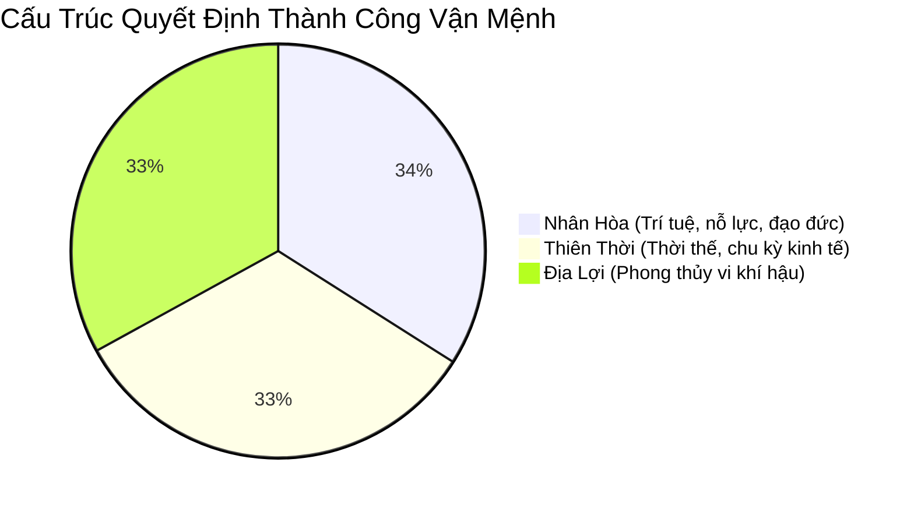

# Chương 6: Cân Bằng & Tham Chiếu: Khoa Học, Tâm Lý & Quy Chuẩn Đạo Đức

> **Khái quát:** Xác lập góc nhìn khách quan, khoa học về phong thủy. Nhìn nhận phong thủy như một công cụ tham khảo vi khí hậu thay vì niềm tin siêu nhiên tuyệt đối. Bóc trần 10 ngộ nhận phổ biến và thiết lập quy chuẩn đạo đức cho người thực hành tư vấn.

---

## 1. Phong Thủy Là Kim Chỉ Nam Định Hướng, Không Phải Định Mệnh Tuyệt Đối

Một trong những sai lầm nguy hại nhất của con người trong xã hội hiện đại là thần thánh hóa phong thủy, coi phong thủy như một phép màu có thể xoay chuyển số mệnh, mang lại giàu sang phú quý tức thì mà không cần lao động sáng tạo.

Trong triết học phương Đông cổ đại, vận mệnh con người được chi phối bởi bộ ba quyền năng **Tam Tài**:
1. **Thiên Thời (Vận trời):** Thời thế xã hội, chu kỳ kinh tế, quy luật sinh thái vũ trụ (chiếm khoảng 33%).
2. **Địa Lợi (Môi trường sống):** Địa thế đất đai, phong thủy nhà ở, sự an lành của không gian cư trú (chiếm khoảng 33%).
3. **Nhân Hòa (Nội tại con người):** Trí tuệ, đạo đức, nỗ lực lao động, cách đối nhân xử thế và ý chí kiên định (chiếm khoảng 34%).

Phong thủy chỉ đóng góp một phần ba vào sự thành bại của một đời người. Dân gian Việt Nam có câu nói bất hủ: *"Đức năng thắng số"*. Một người dù ở trong ngôi nhà phong thủy hoàn mỹ nhưng lười biếng, làm ăn gian dối, sống bạc ác thì sớm muộn cũng chuốc lấy họa diệt vong. Ngược lại, người sống lương thiện, chăm chỉ làm việc thiện nguyện thì ở đâu cũng tỏa ra trường năng lượng tích cực thu hút quý nhân phù trợ.

---

## 2. Đối Chiếu Góc Nhìn Khoa Học Hiện Đại & Phong Thủy Cổ Truyền

Những nguyên lý phong thủy tinh hoa nhất thực chất đều là sự đúc kết kinh nghiệm sống qua hàng ngàn năm về **vi khí hậu (Microclimate)**, **vật lý kiến trúc** và **tâm lý học không gian**:

| Khái Niệm Phong Thủy Cổ | Bản Chất Khoa Học Tự Nhiên & Kiến Trúc |
|:---|:---|
| **Khí (Chi / Qi)** | Dòng chuyển động của không khí, nhiệt độ, độ ẩm và các hạt ion âm có lợi cho quá trình trao đổi chất của cơ thể người. |
| **Tàng phong tụ khí** | Không gian kiến trúc được che chắn khéo léo khỏi gió lùa độc hại mùa đông, nhưng vẫn duy trì luồng thông gió tự nhiên đối lưu dịu nhẹ. |
| **Thủy bao bọc vượng tài** | Sự hiện diện của mặt nước hồ, sông làm mát nhiệt độ không khí mùa hè, bốc hơi nước tạo ion âm giảm bụi mịn, mang lại cảm giác bình an thư thái. |
| **Địa khí / Ác xạ** | Vùng đất nằm trên các đới đứt gãy kiến tạo địa chất phát tán khí phóng xạ Radon tự nhiên hoặc các dị thường địa từ trường gây ức chế tế bào não. |
| **Thương sát (Đường đâm vào cửa)** | Nguy cơ tai nạn giao thông xe mất lái lao vào nhà; Ánh đèn pha ban đêm quét liên tục vào phòng khách làm gián đoạn giấc ngủ sinh học. |

---

## 3. Khi Nào Cần Tham Vấn Chuyên Gia Phong Thủy?

Việc tham vấn ý kiến chuyên gia phong thủy là cần thiết và văn minh khi bạn gặp phải các tình huống sau:
- **Quy hoạch tổng thể các dự án lớn:** Khu đô thị nghỉ dưỡng, nhà xưởng sản xuất quy mô hàng chục hecta, trụ sở ngân hàng hoặc tập đoàn thương mại.
- **Thế đất phức tạp:** Khu đất có hình dạng méo mó, tiếp giáp sườn dốc hoặc nguồn nước phức tạp cần giải pháp san nền và bố trí tổng mặt bằng hài hòa.
- **Cải tạo nhà ở cũ phạm lỗi kiến trúc:** Khi chuyển vào nhà cũ có kết cấu xà ngang đè đầu giường, cầu thang đối diện cửa chính mà không thể đập phá toàn diện.

### Cảnh báo "Thầy phong thủy thương mại hóa":
Cần tỉnh táo nhận diện và tránh xa những người hành nghề lợi dụng sự sợ hãi của gia chủ để trục lợi:
- Luôn phán gia chủ sắp gặp "đại họa", "trùng tang", "phá sản" để gây hoang mang tâm lý.
- Ép buộc gia chủ phải mua các vật phẩm phong thủy đắt tiền (tỳ hưu ngọc tiền triệu, bùa chú trừ tà) với lời hứa hẹn vô căn cứ.
- Đòi đập phá những kết cấu kiến trúc kiên cố một cách vô lý chỉ vì sai lệch vài độ trên la bàn.

---

## 4. Bảng 10 Ngộ Nhận Phong Thủy Phổ Biến (Ngộ Nhận vs Sự Thật Khách Quan)

| STT | Quan Niệm Sai Lầm (Ngộ Nhận Phổ Biến) | Sự Thật Khách Quan & Cơ Sở Khoa Học |
|:---:|:---|:---|
| **1** | Hướng nhà quyết định 100% sự giàu nghèo của chủ nhà. | Hướng nhà chỉ quyết định độ mát mẻ và ánh sáng tự nhiên; Sự thịnh vượng phụ thuộc vào năng lực kinh doanh và quản trị tài chính. |
| **2** | Đất "thóp hậu" (đầu to đuôi nhỏ) là tuyệt đối phá sản. | Đất thóp hậu hoàn toàn có thể thiết kế kiến trúc giật cấp, biến góc hẹp phía sau thành giếng trời hoặc sân vườn tiểu cảnh rất đẹp. |
| **3** | Cứ treo gương bát quái trước cửa là xua tan mọi điềm hung. | Treo gương bát quái sai cách làm chói mắt hàng xóm, gây xích mích láng giềng; Không có gương nào ngăn được ô nhiễm khói bụi hay ngập nước. |
| **4** | Bếp nấu và bàn thờ phải đặt chuẩn xác từng ly theo số đo Lỗ Ban. | Bếp nấu quan trọng nhất là sạch sẽ, thông gió chống cháy nổ; Bàn thờ quan trọng nhất là sự trang nghiêm, tĩnh tại và lòng thành kính tri ân. |
| **5** | Đất ở gần đền chùa, miếu mạo luôn nhận được phước đức lớn. | Vùng đất sát đền chùa thường mang nhiều âm khí u tịch, khói hương dày đặc và ồn ào ngày rằm, mùng một; Không thích hợp cho trẻ nhỏ an cư. |
| **6** | Nhà hướng Tây luôn luôn xấu và nóng bức không thể ở. | Hướng Tây đón trọn cảnh hoàng hôn rực rỡ; Dùng tường cách nhiệt, lam che nắng và trồng cây xanh ban công sẽ tạo nên không gian tuyệt đẹp. |
| **7** | Mua càng nhiều tượng Tỳ Hưu, Thiềm Thừ thì tiền vào càng nhiều. | Vật phẩm trưng bày chỉ có tác dụng nhắc nhở tâm lý tích cực; Tiền tài chỉ đến từ lao động nghiêm túc và quản lý dòng tiền thông minh. |
| **8** | Đường đâm vào nhà là "tử huyệt" không bao giờ được mua. | Nếu đường đâm là ngõ đi bộ nhỏ hoặc có công viên chắn phía trước thì rất thoáng mát; Ở góc độ kinh doanh buôn bán, thế đất này nhận diện thương hiệu cực cao. |
| **9** | Năm phạm Tam Tai hoặc Kim Lâu thì tuyệt đối không được mua nhà. | Năm hạn thực chất là lời nhắc nhở cần cẩn trọng hơn trong quản lý tài chính; Có thể mượn tuổi người thân uy tín động thổ xây dựng rất bình thường. |
| **10** | Phong thủy có thể thay đổi số phận mà không cần nỗ lực bản thân. | Mọi phong thủy tốt nhất trên cõi đời này đều bắt nguồn từ tâm thức hướng thiện, trí tuệ học hỏi và bàn tay lao động cần cù của chính bạn. |

---

## 5. Quy Chuẩn Đạo Đức Cho Người Tư Vấn & Ứng Dụng Phong Thủy

Một chuyên gia tư vấn phong thủy chân chính phải luôn khắc ghi **5 nguyên tắc đạo đức nghề nghiệp**:
1. **Minh Bạch & Khách Quan:** Tôn trọng sự thật khoa học, giải thích rõ ràng nguyên lý tự nhiên đằng sau từng hiện tượng, không dùng từ ngữ mập mờ bí hiểm để lòe bịp khách hàng.
2. **Không Gieo Rắc Sợ Hãi:** Tuyệt đối không bao giờ dọa dẫm về cái chết hay vận hạn để ép gia chủ làm lễ tốn kém hoặc mua vật phẩm trấn yểm.
3. **Ưu Tiên Tiện Nghi Thực Tiễn:** Mọi giải pháp phong thủy đưa ra phải đặt sự an toàn, công năng sử dụng và thẩm mỹ của ngôi nhà lên trên các giáo điều cứng nhắc.
4. **Hợp Tác Đa Ngành:** Tôn trọng ý kiến chuyên môn của kiến trúc sư, kỹ sư kết cấu xây dựng và tuân thủ tuyệt đối quy hoạch pháp luật nhà nước.
5. **Hướng Thiện Làm Gốc:** Luôn khuyến khích gia chủ tu dưỡng đạo đức, sống hòa thuận trong gia đình và có trách nhiệm với cộng đồng xã hội.

---
*Phong thủy đích thực là nghệ thuật sống hài hòa giữa con người với môi trường tự nhiên. Giữ tâm sáng và trí tuệ tỉnh táo, phong thủy sẽ trở thành người bạn đồng hành tin cậy trên con đường kiến tạo cuộc sống an lành.*
