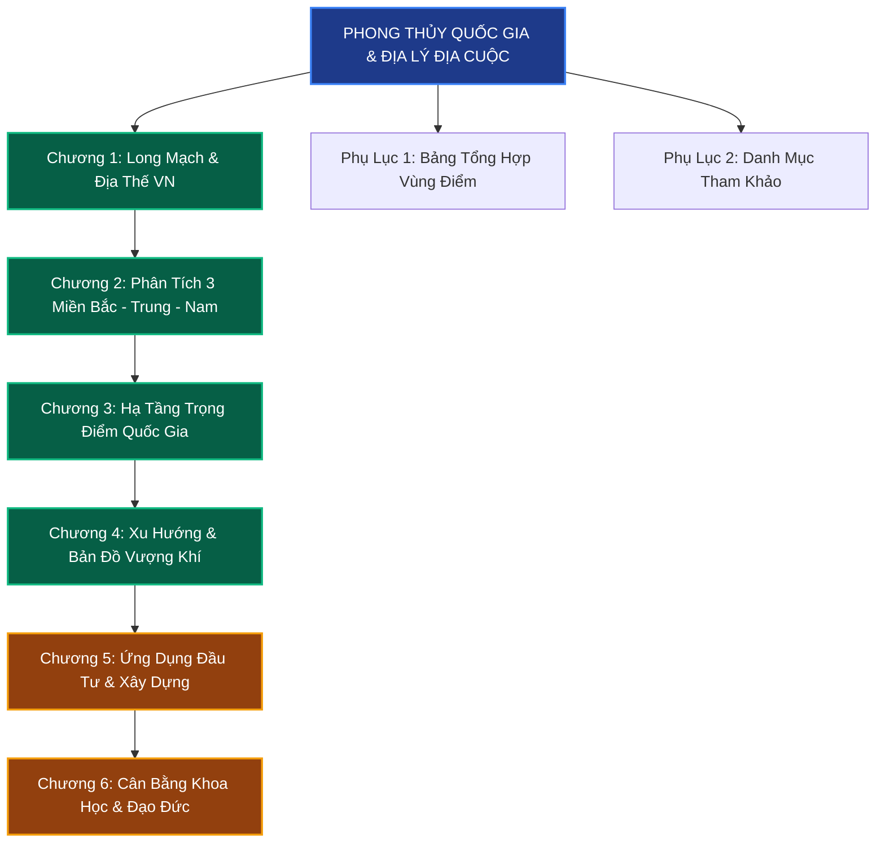

# Chuyên Đề: Phong Thủy Quốc Gia & Địa Lý Địa Cuộc Việt Nam

> **Tổng quan phân hệ Phong Thủy Quốc Gia** trong hệ thống lý thuyết và ứng dụng phong thủy nhà ở, kiến trúc quy hoạch và đầu tư bất động sản tại Việt Nam.

---

## 1. Giới Thiệu Chuyên Đề

Phong thủy không chỉ dừng lại ở quy mô một căn phòng, một ngôi nhà hay một khu đất nhỏ (vi mô). Trong tư tưởng phong thủy cổ truyền Á Đông đỉnh cao, phong thủy khởi nguyên từ **Địa lý vĩ mô** (Phong thủy Quốc gia - Địa cuộc sơn xuyên). Đó là việc quan sát hình thế núi sông, nguồn gốc long mạch, hướng dòng chảy đại giang và sự tương tác giữa lục địa với đại dương để định đô, lập ấp, mở mang bờ cõi và kiến thiết các trung tâm kinh tế xã hội hưng thịnh.

Chuyên đề **"Phong Thủy Quốc Gia & Địa Lý Địa Cuộc Việt Nam"** được biên soạn nhằm mang đến cho bạn đọc, nhà nghiên cứu, kiến trúc sư và nhà đầu tư bất động sản một lăng kính toàn diện:
- Nhận thức rõ chân dung hình thể đất nước hình chữ S - thế đất "Kim Long ẩm hải" (Rồng vàng uống nước biển Đông).
- Nắm bắt sự vận hành của các trục long mạch chính khởi phát từ dãy Côn Lôn qua rặng Hoàng Liên Sơn và Trường Sơn.
- Thấu hiểu đặc trưng trường khí, phong thủy khác biệt của 3 miền Bắc - Trung - Nam.
- Đánh giá tác động tương hỗ của các siêu dự án hạ tầng trọng điểm quốc gia (Sân bay Long Thành, Cao tốc Bắc - Nam, Metro, Cảng biển Cái Mép...) tới dòng chuyển dịch sinh khí và tài lộc.
- Cung cấp phương pháp luận thực chiến và bảng kiểm 10 tiêu chí thẩm định bất động sản kết hợp chặt chẽ giữa phong thủy học với cơ sở khoa học và pháp lý hiện đại.

---

## 2. Cấu Trúc Hệ Thống Tài Liệu

Bộ tài liệu bao gồm **6 chương chuyên sâu** và **2 phụ lục tra cứu thực tiễn**:

### [Chương 1: Tổng Quan Địa Thế & Hệ Thống Long Mạch Việt Nam](./01-tong-quan-dia-the-viet-nam.md)
- Đại long mạch Côn Lôn Sơn xuyên qua bán đảo Đông Dương vào Việt Nam.
- Hình tượng chữ S: Thế rồng uốn lượn vươn mình ôm trọn biển Đông.
- Dãy Trường Sơn - "Long Cốt" xương sống giữ vững nguyên khí quốc gia.
- Mạng lưới sông ngòi (Sông Hồng, Sông Cửu Long) - Động mạch chủ dẫn truyền sinh khí và bồi đắp tài lộc.
- Ưu thế và thách thức phong thủy dải bờ biển dài hơn 3.260 km.
- Bảng tổng hợp 5 yếu tố địa lý vĩ mô cốt lõi dưới góc nhìn phong thủy học.

### [Chương 2: Phân Tích Địa Khí & Phong Thủy Ba Miền Bắc - Trung - Nam](./02-phan-tich-3-mien.md)
- **Bắc Bộ:** Vùng đất Đế đô ngàn năm Thăng Long - Hà Nội, đồng bằng châu thổ sông Hồng tụ khí thâm sâu, phân tích thế đất và cơ hội - thách thức.
- **Trung Bộ:** Vùng đất chuyển tiếp khí trường, phong thủy kinh thành Huế uy nghiêm, sự trỗi dậy mạnh mẽ của đô thị biển Đà Nẵng.
- **Nam Bộ:** Vùng đồng bằng sông Cửu Long và Đông Nam Bộ trù phú, TP. Hồ Chí Minh - cực tăng trưởng "Thủy triều tụ tài", lực đẩy phong thủy từ chuỗi đô thị vệ tinh.
- Bảng đối chiếu 3 miền qua 6 tiêu chí phong thủy nền tảng.
- Hàm ý chiến lược đầu tư và định hướng phát triển không gian cho từng vùng miền.

### [Chương 3: Phong Thủy & Tác Động Trường Khí Các Công Trình Trọng Điểm Quốc Gia](./03-cong-trinh-trong-diem.md)
- **Cảng hàng không quốc tế Long Thành:** Vị trí tụ hội Kim - Thổ, bán kính tác động trường khí và cực tăng trưởng mới phía Nam.
- **Đại lộ cao tốc Bắc - Nam:** Dòng sinh khí nhân tạo khai thông huyết mạch, kết nối các huyệt vị kinh tế dọc sườn Trường Sơn.
- **Hệ thống Metro Hà Nội & TP. Hồ Chí Minh:** Vận hành dòng địa khí ngầm đô thị, kích hoạt mô hình TOD (Transit-Oriented Development).
- **Cụm cảng nước sâu Cái Mép - Thị Vải:** Hải môn tụ thủy, cửa ngõ đón tài khí giao thương quốc tế.
- Bảng đánh giá chi tiết 8 công trình hạ tầng thế kỷ dưới lăng kính phong thủy học.

### [Chương 4: Xu Hướng Phát Triển & Bản Đồ Vượng Khí Các Vùng Đất Mới](./04-xu-huong-phat-trien-vung-dat.md)
- **Vùng đất trỗi dậy (Rising Zones):** Sức bật mạnh mẽ của Đồng Nai, Bình Dương, Long An từ hạ tầng đồng bộ và thổ nhưỡng ổn định.
- **Vùng đất ổn định (Stable Zones):** Sự tôn quý, trường tồn của Ba Đình - Tây Hồ (Hà Nội) và Quận 1, Quận 3, Quận 7 (TP.HCM).
- **Vùng đất cần quan sát (Watch Zones):** Các khu vực trũng ngập, sạt lở ven sông biển, tác động biến đổi khí hậu và phương pháp "tỵ hung xu cát".
- Bảng thẩm định 10 vùng đất chiến lược kết hợp xếp hạng phong thủy và tiềm năng đầu tư.

### [Chương 5: Ứng Dụng Phong Thủy Quốc Gia Vào Thẩm Định Đầu Tư & Xây Dựng](./05-ung-dung-vao-dau-tu-xay-dung.md)
- Phương pháp luận phân tích địa thế từ Vĩ mô đến Vi mô (Top-Down Feng Shui).
- Bộ quy tắc kiểm tra 10 tiêu chí (10-Point Checklist) thẩm định bất động sản thực chiến.
- Ma trận tích hợp: Kết hợp hài hòa giữa Phong thủy đắc địa và Pháp lý an toàn.
- Kỹ thuật giải quyết xung đột khi phong thủy không tương thích với nhu cầu công năng hiện đại.
- Khung mẫu ra quyết định đầu tư bất động sản chuẩn xác (Decision-Making Framework).

### [Chương 6: Góc Nhìn Cân Bằng: Khoa Học, Tâm Lý & Quy Chuẩn Đạo Đức](./06-can-bang-tham-chieu.md)
- Phong thủy là khoa học vi khí hậu và môi trường định hướng, không phải niềm tin mù quáng định mệnh.
- Đối chiếu khoa học tự nhiên (địa từ trường, bức xạ, thủy văn) với học thuyết âm dương ngũ hành cổ xưa.
- Khi nào và làm thế nào để tham vấn chuyên gia phong thủy chân chính?
- Bảng vạch trần 10 ngộ nhận phong thủy phổ biến (Thần bí hóa vs Hiện thực khoa học).
- 5 quy chuẩn đạo đức cốt lõi dành cho người thực hành và tư vấn phong thủy.

### [Phụ Lục 1: Bảng Tổng Hợp Vùng Điểm Phong Thủy & Tiềm Năng Bất Động Sản Toàn Quốc](./phu-luc/bang-tong-hop-vung-diem.md)
- Bảng tra cứu toàn diện hơn 25 vùng kinh tế, tỉnh thành trọng điểm: Địa thế, ngũ hành, điểm phong thủy (thang điểm 10), thế mạnh, rủi ro và chiến lược đầu tư.

### [Phụ Lục 2: Danh Mục Tài Liệu Tham Khảo & Nguồn Nghiên Cứu](./phu-luc/nguon-tham-khao.md)
- Tổng hợp các cổ thư kinh điển (Táng Thư, Thanh Nang Kinh, Địa Lý Tả Ao), thư tịch địa chí Việt Nam, quy hoạch quốc gia đến năm 2050 và các công trình khoa học hiện đại.

---

## 3. Bản Đồ Liên Kết Nội Dung

---
*Phân hệ được nghiên cứu và cấu trúc chuẩn mực, hướng tới tư duy duy vật biện chứng, kết hợp tinh hoa văn hóa phương Đông với quy hoạch kiến trúc đương đại.*
